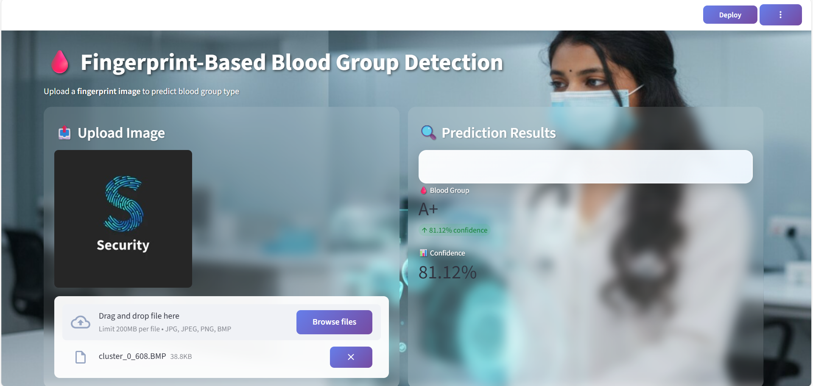

# 🩸 Blood Group Detection Using Fingerprint

## 📌 Project Overview

Blood Group Detection Using Fingerprint is a Deep Learning-based system that predicts a person's blood group from fingerprint images. The project utilizes image processing techniques and Convolutional Neural Networks (CNNs) to classify fingerprint patterns into different blood groups.

---

## 🚀 Features

- Blood group prediction using fingerprint images.
- Deep Learning-based classification.
- User-friendly web interface.
- Performance analysis using accuracy and loss graphs.
- Comparison of multiple CNN architectures.
- Fast and efficient prediction system.

---

## 🛠️ Technologies Used

- Python
- TensorFlow / Keras
- OpenCV
- NumPy
- Pandas
- Flask
- Jupyter Notebook

---

## 🧠 CNN Models Used

- AlexNet
- LeNet
- ResNet34
- VGG16

---


## 📸 ## 📸 Project Screenshots

### 🏠 Home Page


### 🔍 Prediction Result




---

## ⚙️ Installation

### Clone the Repository

```bash
git clone https://github.com/Reddy1727/BLOOD-GROUP-DETECTION.git
cd BLOOD-GROUP-DETECTION
```

### Install Dependencies

```bash
pip install -r requirements.txt
```

### Run the Application

```bash
python app.py
```

---

## 📊 Results

The project compares multiple CNN architectures such as AlexNet, LeNet, ResNet34, and VGG16 using:

- Accuracy
- Validation Accuracy
- Loss
- Validation Loss

Performance graphs are available in the `graphs` folder.

---


## 👨‍💻 Author

Narayana Reddy Y L


## 📜 License

This project is developed for educational and research purposes.